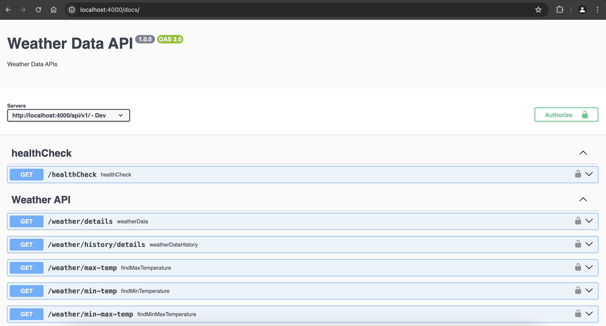
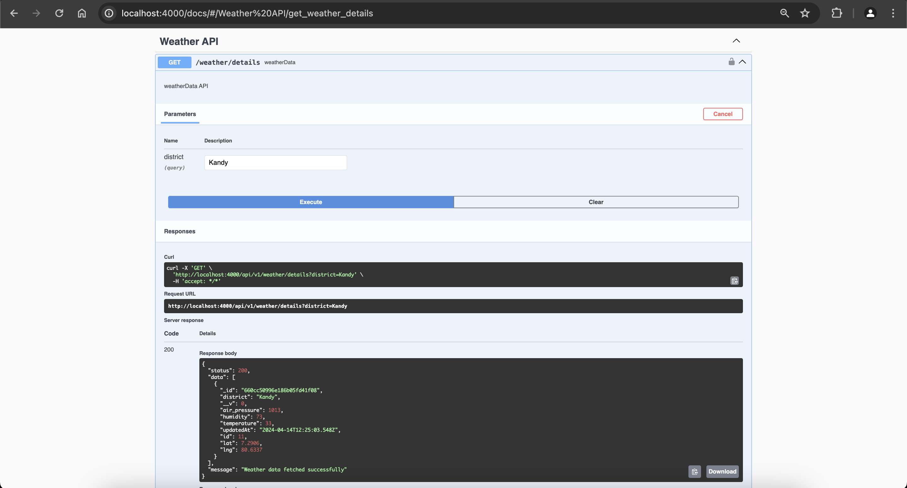

# weather-api-backend

# Student ID : COBSCCOMP4Y222P-011

# WEATHER MAP BACKEND

This project is a backend API built with Node.js that provides weather data for a frontend application. The frontend application is a React-based map displaying weather data for 24 districts in Sri Lanka. The weather data includes temperature, humidity, air pressure, and the latest updated date. The frontend and backend are synced to ensure real-time data updates.

## DEMO

You can find a live demo of the application [here](https://avishka.tech/).


## FEATURES

- Provides APIs to fetch weather data for 24 districts in Sri Lanka.
- Supports filtering weather data by district.
- Provides APIs for fetching maximum and minimum temperature data.
- Supports fetching weather data history.
- Utilizes Swagger for API documentation.

1. Swagger :

   

   

## Installation

1. Clone the repository:

```
git clone https://github.com/A-Samod/weather-api-backend
```

2. Navigate to the project directory:

```
cd weather-api-backend
```

3. Install dependencies:
```
npm install
```

4. Start the server:
```
npm start
```
5. Open http://localhost:4000 to view it in the browser.

## Frontend Repository

The backend repository for this project can be found [here](https://github.com/A-Samod/weather-api-frontend).
